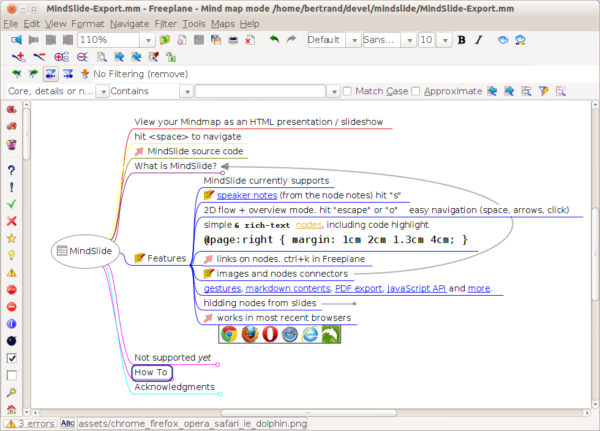
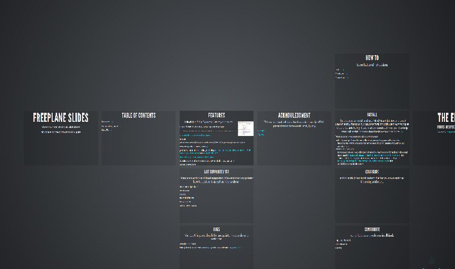

#Mindslide

View mindmap as an HTML presentation (aka Freeplane/Freemind to powerpoint slideshow).

Mindslide uses the great  [Reveal.js](http://lab.hakim.se/reveal-js/) HTML presentation framework to make stunning slideshow presentations from your [Freeplane](http://sourceforge.net/projects/freeplane) (and possibly freemind) mindmaps.

## Features

MindMap Slide Export currently supports

* simple & rich-text nodes
* clickable links (ctrl+k in Freeplane)
* images
* presenter notes (from the node notes), hit "s" to get the presenter view
* easy navigation (space, arrows)
* gestures and [more](http://lab.hakim.se/reveal-js/), including nested slides, markdown contents, PDF export, speaker notes and a JavaScript API.
* decent browser support and fall-back
* 2D slides presentation and overview mode (hit 'escape' or 'o')
* nodes connectors


## Prerequesite

You need a recent browser and a webserver (any server will do, on any OS).

Firefox works without webserver, simply open the mindslide.html file. Chrome requires the webserver. IExplorer and others untested.


## Installation

in a directory served by your webserver do the following:

```
git clone https://github.com/berteh/mindslide.git
cd mindslide (or dir mindslide in windows)
git submodule update --init
```

or unzip the 2 archives https://github.com/berteh/mindslide/archive/master.zip in mindslide/ and https://github.com/hakimel/reveal.js/archive/master.zip in mindlide/reveal.js

Visit http://your-host/mindslide/mindslide.html (or simply open your local mindslide.html with Firefox) and enjoy.

To display your own mind map simply copy them to the web directory as mm.xml (or change the related 'link' element in the header of mindslide.html file).

The process to install and use MindMap Slide Export is not user-friendly for now, but anyone familiar with web technologies should be able to try it out in a few minutes. If you want to help streamline this process dont hesitate to contribute!

## Help and support

Use the [Mindslide issue tracker](https://github.com/berteh/mindslide/issues) for your questions / suggestions.

Integration within Freeplan is [being discussed on the Freeplan forum](https://sourceforge.net/apps/phpbb/freeplane/viewtopic.php?f=1&t=750&p=3712#p3708).

## Screenshots

The (documentation and) example mindmap is rendered (below) as a nice HTML presentation:  

The *Features slide* is the view generated for the "Features" node and its children:
")

The *Overview mode* is great to change the flow of your presentation:


More features in the demo of [Reveal.js](http://lab.hakim.se/reveal-js/).