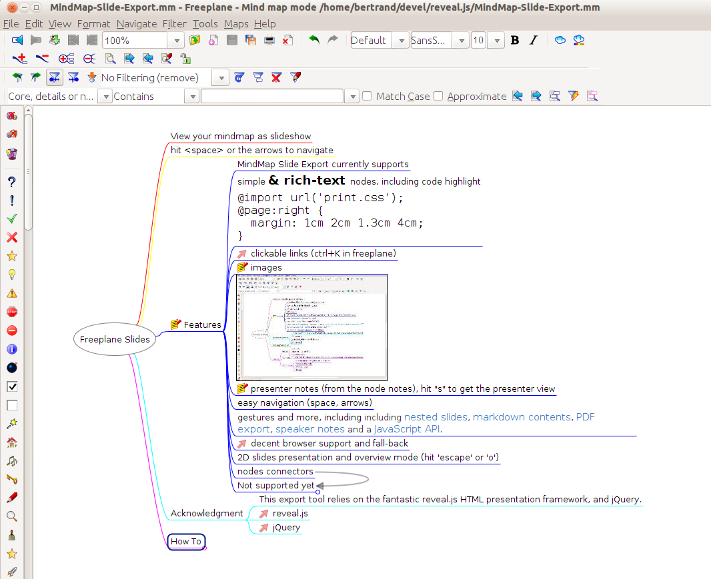

#Mindslide

View mindmap as an HTML presentation (aka Freeplane/Freemind to powerpoint slideshow).

Checkout our **[online demonstration & documentation](http://berteh.github.io/mindslide/)**!

Mindslide is an export extension for [Freeplane](http://sourceforge.net/projects/freeplane). It uses the [Reveal.js](http://lab.hakim.se/reveal-js/) HTML presentation framework to make stunning slideshow presentations from your Freeplane (and possibly Freemind) mindmaps.

## Help and support

Use the [Mindslide issue tracker](https://github.com/berteh/mindslide/issues) for your questions / suggestions.

Integration within Freeplan is [being discussed on the Freeplan forum](https://sourceforge.net/apps/phpbb/freeplane/viewtopic.php?f=1&t=750&p=3712#p3708).

## Screenshots

The (documentation and) [example mindmap](MindSlide-Export.mm) is rendered (below) as a nice HTML presentation:  

The *Features slide* is the view generated for the "Features" node and its children:
")

The *Overview mode* is great to change the flow of your presentation:

More features in the demo of [Reveal.js](http://lab.hakim.se/reveal-js/).